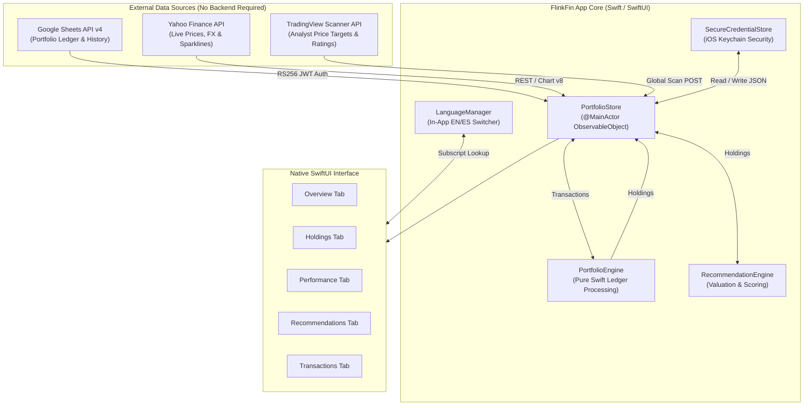
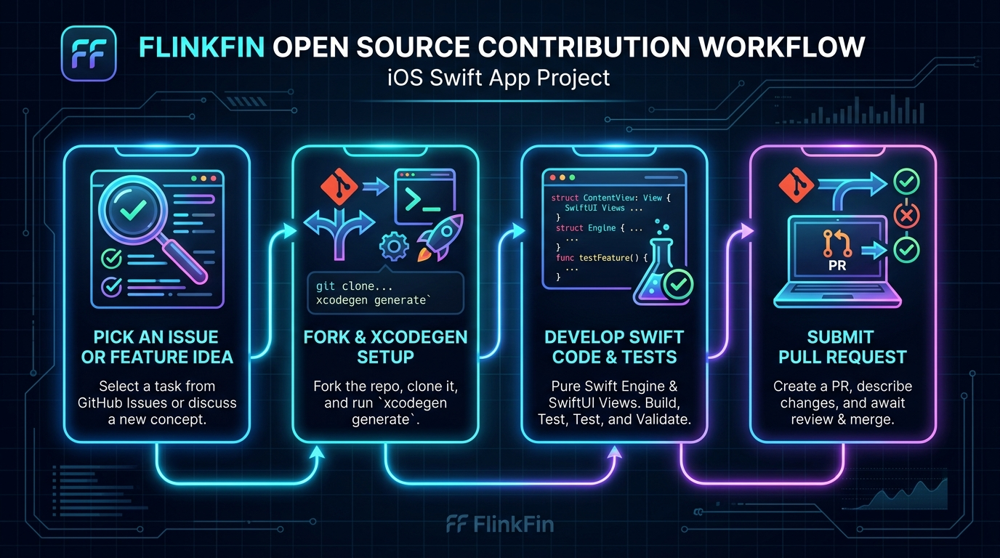

# Contributing to FlinkFin (iOS) 🚀

Welcome to the **FlinkFin iOS** community! We are excited that you want to participate in building a modern, privacy-focused financial portfolio dashboard for iPhone and iPad.

Whether you're an iOS developer looking to add a new chart component, a financial enthusiast refining the recommendation scoring engine, or a translator adding a new language, **your contributions are warmly welcomed!**

---

## 📸 Architecture & System Overview

FlinkFin is designed to be **lightweight, standalone, and privacy-first**. The app runs directly on your Apple device and communicates straight with Google Sheets and Yahoo Finance APIs — with **zero middleman server**, zero tracking, and zero stored credentials outside your encrypted iOS Keychain.


### High-Level System Architecture



---

## 🛠️ Contribution Workflow

Contributing is straightforward. Follow this 4-step workflow:



### Step 1: Pick an Issue or Feature Idea
Check out our open issues or check the [Roadmap & High-Value Contribution Opportunities](#-roadmap--high-value-contribution-opportunities) list below. If you have a new idea, open an issue first to discuss the design.

### Step 2: Set Up Your Development Environment
1. **Fork** the repository on GitHub.
2. **Clone** your fork locally:
   ```bash
   git clone https://github.com/YOUR_USERNAME/FlinkFin-iOS.git
   cd FlinkFin-iOS
   ```
3. Generate the Xcode project using **XcodeGen**:
   ```bash
   brew install xcodegen
   xcodegen generate
   open FlinkFin.xcodeproj
   ```
4. Select your development team in Xcode (**Signing & Capabilities**).

### Step 3: Develop & Test Your Code
- **Pure Swift Engine**: Pure calculation logic (`PortfolioEngine`, `RecommendationEngine`, `Formatters`) is decoupled from UI views and networking.
- **SwiftUI Views**: Follow native iOS Human Interface Guidelines (HIG) with dynamic type, smooth animations, and clean responsive layouts.
- **In-App Localization**: Any new UI string should be added to both `Strings+en.swift` and `Strings+es.swift` and accessed via `lm["key_name"]`.

### Step 4: Submit a Pull Request (PR)
- Create a feature branch: `git checkout -b feature/my-cool-feature`
- Commit your changes with clear, descriptive commit messages.
- Push to your fork and submit a PR against `main`.

---

## 🌟 Roadmap & High-Value Contribution Opportunities

Looking for inspiration on where to jump in? Here are some of the top high-impact features planned for FlinkFin:

| Feature Area | Description | Priority | Key Files |
|---|---|---|---|
| 📊 **Advanced Charts** | Build SwiftUI charts for annual breakdown, currency allocation donut, top-10 bar chart, and concentration treemap | High | `Views/PerformanceView.swift`, `Views/OverviewView.swift` |
| 🌍 **Additional Languages** | Add support for new languages (e.g. French, German, Japanese) to `LanguageManager` | Medium | `Localizations/LanguageManager.swift` |
| 🔔 **Price Target Alerts** | Local push notifications when a stock hits its analyst target price | Medium | `Engine/PortfolioStore.swift` |
| 📱 **Home Screen Widgets** | iOS 17 WidgetKit widgets displaying net worth & daily changes | Medium | `FlinkFinWidget/` (New Target) |
| ⌚ **watchOS Companion** | Quick portfolio value glance app for Apple Watch | Low | `FlinkFinWatch/` (New Target) |

---

## 📐 Code Conventions & Guidelines

- **Language for Code Comments**: Write all inline code comments, docstrings, and PR titles in **English**.
- **Language for Changelog**: Entries in `CHANGELOG.md` are maintained in Spanish (matching the companion Python dashboard project).
- **Read-Only Sheets Rule**: The app is strictly **read-only** against Google Sheets. Never attempt to write or mutate rows on the user's primary transaction sheets.
- **Security Rule**: Never write service account private keys or credentials to unencrypted disk or `UserDefaults`. Always use `SecureCredentialStore`.
- **Pure Computation Rule**: Keep calculation logic in `PortfolioEngine.swift` in sync with `compute_holdings()` in the Python dashboard.

---

## ❓ Need Help or Have Questions?

Feel free to open an issue or start a discussion thread on GitHub. We are happy to help onboard new contributors!

Thank you for helping make **FlinkFin** better for everyone! 🚀
