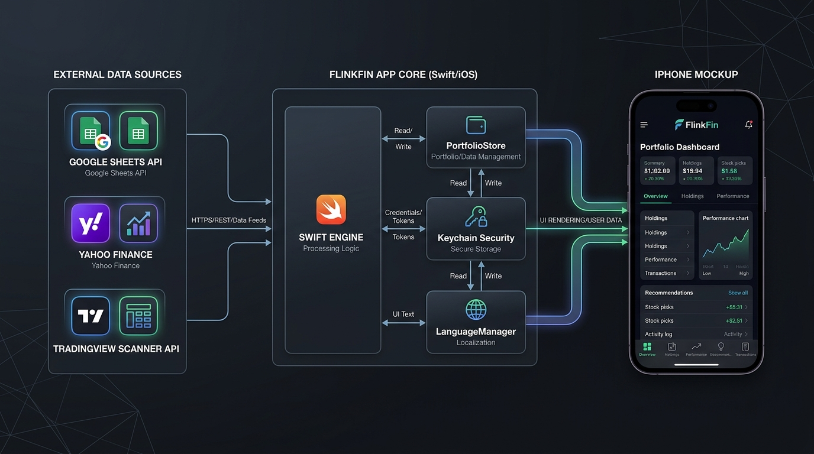

# FlinkFin — iOS Portfolio Dashboard

A native SwiftUI app that mirrors a financial portfolio dashboard on iPhone/iPad. It connects **directly** to Google Sheets and Yahoo Finance from the device — no intermediate server or backend required.

> **Status**: actively maintained. Compiles and runs on iOS 17+. Some advanced chart views (annual breakdown, treemap) are planned but not yet implemented.

---

## Table of Contents

1. [Features](#features)
2. [Architecture Overview](#architecture-overview)
3. [Project Structure](#project-structure)
4. [Requirements](#requirements)
5. [Setup](#setup)
6. [Security & Privacy](#security--privacy)
7. [Data Sources](#data-sources)
8. [Recommendation Engine](#recommendation-engine)
9. [Localization & Languages](#localization--languages)
10. [Known Limitations](#known-limitations)
11. [Contributing](#contributing)

---

## Features

- **5 main tabs**: Overview, Holdings, Performance, Recommendations, Transactions
- **In-app language switcher (English / Spanish)**: Toggle app language at runtime from Settings (⚙️) with instant UI update and `@AppStorage` persistence
- **Real-time prices** via Yahoo Finance (unofficial chart endpoint — same as `yfinance`)
- **Portfolio history & intraday charts** (1D / 5D / 1M / 3M / 6M / 1Y / 2Y / All)
- **Multi-currency support**: SGD, USD, HKD, AUD with live FX rates and display currency conversion (S$ / €)
- **Analyst price targets** via TradingView Scanner API (free, no key required), with Yahoo Finance and Finviz as fallbacks
- **Buy / Hold / Take Profit recommendations** based purely on market valuation — not on personal P&L
- **No third-party dependencies** — JWT signing uses Apple's `Security.framework` directly
- **Credentials stored in Keychain** — Google Service Account JSON never touches disk unencrypted

---

## Architecture Overview



```
┌─────────────────────────────────────────────────────────────┐
│                        SwiftUI Views                        │
│  OverviewView  HoldingsView  PerformanceView  Recs  Txns   │
│                 (connected to LanguageManager)              │
└────────────────────────┬────────────────────────────────────┘
                         │ @StateObject / @EnvironmentObject
                         ▼
┌─────────────────────────────────────────────────────────────┐
│                      PortfolioStore                         │
│  (ObservableObject — single source of truth for all views)  │
│  • Coordinates fetching, caching and refreshing             │
│  • Publishes: holdings, history, prices, FX rates           │
└──────────┬──────────────────────┬───────────────────────────┘
           │                      │
           ▼                      ▼
┌──────────────────┐   ┌──────────────────────────────────────┐
│  PortfolioEngine │   │           Networking Layer            │
│  (pure Swift,    │   │                                      │
│   no async/IO)   │   │  GoogleSheetsClient  — reads txns,   │
│                  │   │    history, FX from Google Sheets     │
│  compute_        │   │                                      │
│  holdings()      │   │  YahooFinanceClient  — prices,       │
│                  │   │    sparklines, analyst targets,       │
│  Aggregates txns │   │    FX rates via Yahoo + TradingView   │
│  → Holding[]     │   │                                      │
└──────────────────┘   │  JWTSigner           — signs Google  │
                       │    OAuth2 JWT using Security.framework│
┌──────────────────┐   │                                      │
│  Recommendation  │   │  SecureCredentialStore — Keychain    │
│  Engine          │   │    read/write for service account    │
│                  │   └──────────────────────────────────────┘
│  Pure function:  │
│  Holding[] →     │
│  Signal[]        │
└──────────────────┘
```

### Key Design Decisions

| Decision | Rationale |
|---|---|
| **Native SwiftUI, no WKWebView** | Full native performance, smooth animations, native iOS feel |
| **No FastAPI backend dependency** | Standalone operation; reads Sheets + Yahoo directly from device |
| **In-app language switcher** | Dynamic runtime toggle between English and Spanish without requiring device reboot/restart |
| **No SPM packages** | JWT signing done with `Security.framework` to avoid third-party dependencies for credential-sensitive code |
| **Keychain for credentials** | `kSecAttrAccessibleAfterFirstUnlockThisDeviceOnly` — credentials never stored on disk or in `UserDefaults` |
| **Read-only against Google Sheets** | The app never writes to the spreadsheet |

---

## Project Structure

```
FlinkFin/
├── FlinkFinApp.swift              # App entry point, onboarding gate & language provider
│
├── Localizations/                 # In-app localization engine
│   ├── LanguageManager.swift      # ObservableObject with @AppStorage("appLanguage")
│   ├── Strings+en.swift           # English string dictionary
│   └── Strings+es.swift           # Spanish string dictionary
│
├── Models/
│   ├── Transaction.swift          # Single buy/sell/dividend record
│   ├── Holding.swift              # Aggregated position (ticker + metrics)
│   └── HistoryPoint.swift         # Portfolio value at a point in time
│
├── Engine/
│   ├── Formatters.swift           # Shared numeric, currency, and percentage formatting
│   ├── PortfolioEngine.swift      # computeHoldings(): transactions → holdings
│   ├── RecommendationEngine.swift # recommend(): holdings → localized signals & factors
│   └── PortfolioStore.swift       # @MainActor ObservableObject, async refresh & state
│
├── Networking/
│   ├── GoogleSheetsClient.swift   # Sheets API v4 client (JWT auth)
│   ├── YahooFinanceClient.swift   # Prices, FX, sparklines, analyst targets
│   ├── JWTSigner.swift            # RS256 JWT for Google OAuth2
│   └── SecureCredentialStore.swift# Keychain wrapper
│
└── Views/
    ├── Components/
    │   └── MiniLineChart.swift    # Sparkline chart component
    ├── OnboardingCredentialsView.swift
    ├── OverviewView.swift
    ├── HoldingsView.swift
    ├── PerformanceView.swift
    ├── RecommendationsView.swift
    ├── TransactionsView.swift
    └── SettingsView.swift         # Language selector sheet
```

### Module Mapping (iOS ↔ Python dashboard)

| iOS (Swift) | Python equivalent |
|---|---|
| `Models/Transaction.swift` | `transactions` table (database.py) |
| `Models/Holding.swift` | dict from `compute_holdings()` |
| `Engine/PortfolioEngine.swift` | `compute_holdings()` in database.py |
| `Engine/RecommendationEngine.swift` | `recommend()` in dashboard_server.py |
| `Engine/PortfolioStore.swift` | `build_portfolio_data()` in dashboard_server.py |
| `Localizations/LanguageManager.swift` | *(iOS exclusive — in-app EN/ES language switcher)* |
| `Networking/GoogleSheetsClient.swift` | gsheets_sync.py + `_import_*` functions |
| `Networking/JWTSigner.swift` | google-auth Python package |
| `Networking/YahooFinanceClient.swift` | `_fetch_fx_live` / `_fetch_prices_live` / `_fetch_sparklines_live` |
| `Networking/SecureCredentialStore.swift` | *(no equivalent — web app stores JSON on disk)* |

---

## Requirements

- **Xcode 16+** (macOS Sequoia or later recommended)
- **iOS 17+** deployment target
- A **Google Cloud Service Account** with read access to your portfolio spreadsheet (same JSON used by the desktop dashboard)
- No paid Apple Developer account needed for personal device installation

---

## Setup

### 1. Clone and open the project

```bash
git clone https://github.com/cdavidhr/FlinkFin-iOS.git
cd FlinkFin-iOS
```

**Option A — XcodeGen** (recommended for iterating):
```bash
brew install xcodegen
xcodegen generate
open FlinkFin.xcodeproj
```

**Option B — Manual**: Open Xcode → File → Open → select `FlinkFin.xcodeproj`.

### 2. Sign the app

In Xcode: select the `FlinkFin` target → **Signing & Capabilities** → choose your Apple ID in **Team**.

### 3. Import your Google Service Account

The app shows an onboarding screen on first launch:

1. Copy `service_account.json` to your iPhone via AirDrop or iCloud Drive.
2. Tap **Import service_account.json** and select the file.
3. Enter your **Google Sheets spreadsheet ID** (the long string in the sheet URL).
4. Tap **Save** — the JSON is stored in the iOS Keychain immediately; the file is not kept.

> The spreadsheet ID is not a secret (it's in your browser URL bar when you open the sheet), but the service account private key is sensitive and is protected by the Keychain.

### 4. Run

Press **⌘R** (or the ▶ button) to build and run on your device or simulator.

---

## Security & Privacy

### What the app stores

| Data | Where | Notes |
|---|---|---|
| Service account JSON | iOS **Keychain** | `kSecAttrAccessibleAfterFirstUnlockThisDeviceOnly` — device-specific, not iCloud-synced |
| Spreadsheet ID | `UserDefaults` | Visible in the Google Sheets URL bar |
| Language preference | `UserDefaults` (`@AppStorage`) | `"en"` or `"es"` string |
| Prices / portfolio data | **In-memory only** | Never written to disk |

### What is NOT in this repository

- No API keys, tokens, or secrets of any kind
- No real financial data (holdings, transactions, balances)
- No personal information
- The `.gitignore` explicitly excludes `service_account*.json`, `*serviceaccount*.json`, `*.pem`, `*.key`

---

## Data Sources

### Prices & FX Rates
- **Yahoo Finance** unofficial chart endpoint: `query1.finance.yahoo.com/v8/finance/chart/{ticker}`
- FX pairs: `USDSGD=X`, `HKDSGD=X`, `AUDSGD=X`, `EURSGD=X`
- Fallback static rates if network is unavailable

### Analyst Price Targets & Ratings

Three-tier fallback chain (all free, no API key required):

1. **TradingView Scanner API** (`scanner.tradingview.com/global/scan`) — Primary source. Single batch POST request for all tickers. Supports global exchanges: NASDAQ, NYSE, SGX, LSE, ASX, etc.
2. **Yahoo Finance `quoteSummary`** with crumb+cookie authentication — Secondary.
3. **Finviz** HTML scraping — Tertiary, US tickers only.

### Portfolio Data
- **Google Sheets** via Sheets API v4 (RS256 JWT signed with `Security.framework`)
- Read-only access to transactions and portfolio history sheets

---

## Recommendation Engine

Signals are calculated purely from **market valuation**, not from your personal P&L:

```
Score components:
  +3  if recommendationKey == "strong_buy"
  +2  if recommendationKey == "buy"
  +1  if recommendationKey == "hold" (slight buy lean)
  +2  if current price < analyst mean target (upside potential)
  +1  if current price < analyst low target (deep discount)
  -2  if current price > analyst high target (overvalued vs. all estimates)
  -1  if current price > 110% of analyst mean target

Signal thresholds:
  ≥ 4  → STRONG BUY  🟢
  ≥ 2  → BUY         🟩
   0–1 → HOLD        🟡
  < 0  → TAKE PROFIT RED 🔴
```

---

## Localization & Languages

The app includes built-in support for **English** and **Spanish**:

- **Dynamic switching**: Tap the gear icon (⚙️) on the Overview screen to open Settings and select your preferred language. All tab titles, section headers, badges, button labels, and recommendation factor descriptions update instantly without restarting the app.
- **Persistence**: Your selection is remembered across sessions via `@AppStorage("appLanguage")`.
- **String Architecture**: Localized strings are stored in `Strings+en.swift` and `Strings+es.swift` and resolved through `LanguageManager.shared`.

---

## Known Limitations

1. **`JWTSigner.swift`** — manually unpacks PKCS#8 DER to PKCS#1 RSA for `SecKeyCreateSignature`.
2. **Yahoo Finance endpoint** — unofficial endpoint; if Yahoo changes headers/response formats, pricing updates may require adjustments.
3. **`GoogleSheetsClient.fetchPortfolioHistory()`** — intentionally replicates a row-skip discrepancy from the Python dashboard (1 vs 2 header rows).
4. **Pending charts** — Annual breakdown table, currency allocation donut, top-10 bar chart, and concentration treemap are planned for future releases.

---

## Contributing

We welcome community participation! Whether you want to add new chart components, improve localization, or enhance analytics, please read our **[Contributor Guide (CONTRIBUTING.md)](CONTRIBUTING.md)** for a visual walkthrough of the architecture, workflow, and open roadmap items.

Bug reports and feature suggestions are welcome via GitHub Issues.

**Code conventions:**
- **All Swift source code comments are written in English.**
- **Public documentation (`README.md`, `docs/ARCHITECTURE.md`) and `AGENTS.md` instructions are in English.**
- **Session history entries in `CHANGELOG.md` are kept in Spanish** (matching the companion Python dashboard project).
- Logic must stay in sync with the Python dashboard — if you change `PortfolioEngine.swift`, update `compute_holdings()` in the dashboard too, and log both changes in their respective `CHANGELOG.md`.
- Never write to the Google Sheet from this app.
- Never store credentials outside the Keychain.

---

## License

Private repository — all rights reserved.
